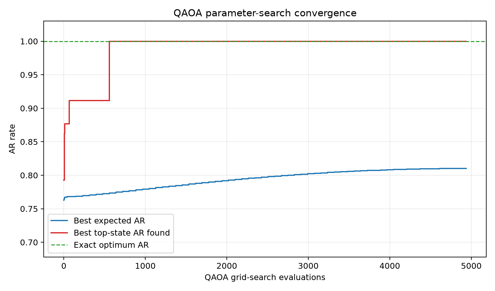
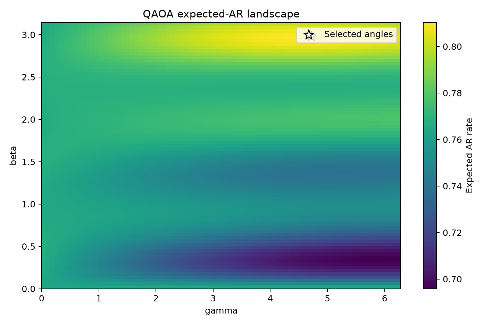
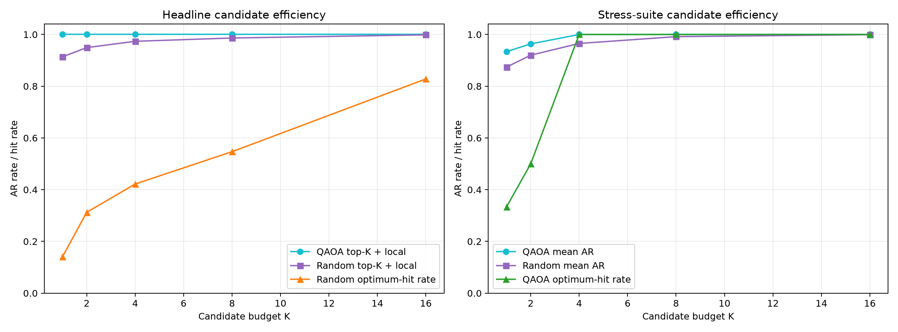
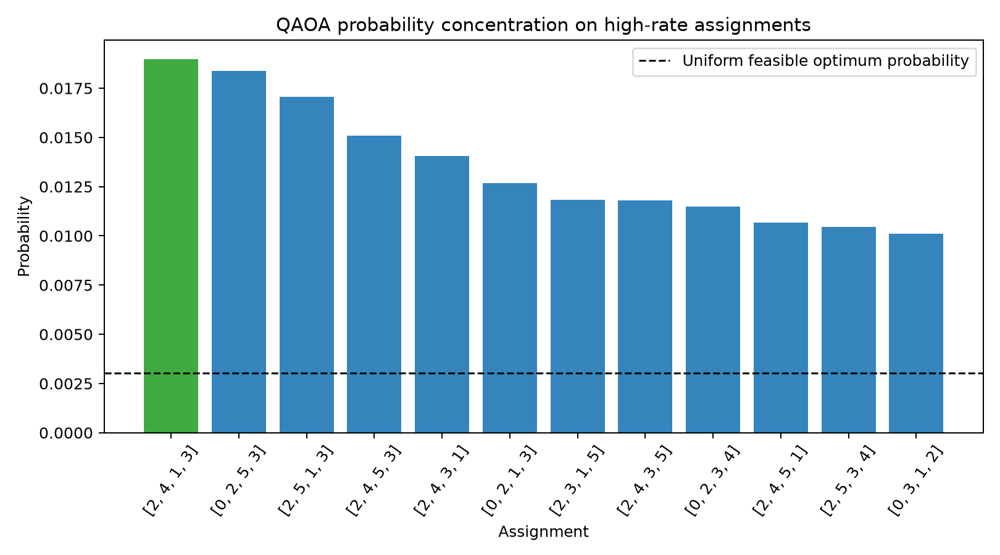
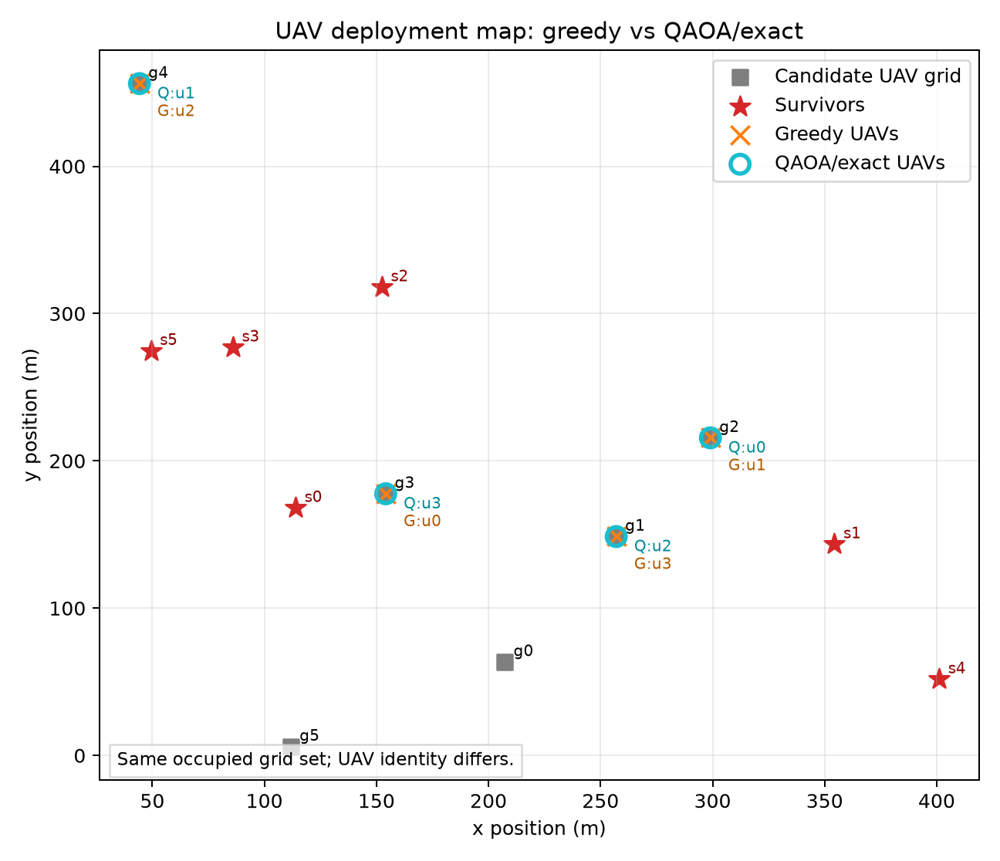

# QAOA-ISAC UAV Deployment

This project formulates UAV placement for integrated sensing and communication
as a constrained quantum optimization problem. The deployment must assign UAVs
to candidate 3-D grid points while respecting one-hot assignment, no
co-location, survivor SINR, and collision-avoidance constraints.

The strongest result is a valid-subspace QAOA-guided candidate generator plus
classical local search. The valid-subspace solver keeps the search inside
feasible UAV assignments, ranks candidates by QAOA probability, and then uses
local search to polish only a small top-K candidate set.

## Result Snapshot

The current benchmark evidence is regenerated in
`qaoa_isac_benchmark_results.json`.

| Scenario | Method | AR rate | Notes |
| --- | --- | ---: | --- |
| Headline `U=4, G=6, S=6` | Exact enumeration | 1.000 | Feasible optimum reference |
| Headline `U=4, G=6, S=6` | Greedy | 0.811 | Feasible but 18.9% below optimum |
| Headline `U=4, G=6, S=6` | Valid-subspace QAOA top state | 1.000 | Matches exact optimum |
| Headline `U=4, G=6, S=6` | QAOA top-8 + local search | 1.000 | Matches exact optimum |
| Multi-seed suite `U=3, G=6, S=5` | QAOA top-8 + local search | 0.999 mean | 25 evaluated seeds |
| Stress seeds | QAOA top-4 + local search | 1.000 mean | 12/12 optimum hits |

QAOA assigns 6.25x more probability to the headline optimum than uniform
feasible sampling. At a 95% target success probability, the headline optimum
requires 157 QAOA samples versus 985 uniform feasible samples.

## Candidate-Efficiency Evidence

The judging-relevant comparison is not just "QAOA can find a good answer"; it
is whether QAOA helps under the same candidate budget. The top-K sweep compares
QAOA-ranked candidates against random top-K multi-start local search.

Headline benchmark:

| K | QAOA AR | Random top-K + local AR | QAOA gain | Random optimum hit rate |
| ---: | ---: | ---: | ---: | ---: |
| 1 | 1.000 | 0.914 | 0.086 | 0.141 |
| 2 | 1.000 | 0.949 | 0.051 | 0.312 |
| 4 | 1.000 | 0.974 | 0.026 | 0.422 |
| 8 | 1.000 | 0.986 | 0.014 | 0.547 |
| 16 | 1.000 | 0.999 | 0.001 | 0.828 |

Stress suite:

| K | QAOA mean AR | Random mean AR | QAOA optimum hits |
| ---: | ---: | ---: | ---: |
| 1 | 0.934 | 0.874 | 4/12 |
| 2 | 0.964 | 0.920 | 6/12 |
| 4 | 1.000 | 0.965 | 12/12 |
| 8 | 1.000 | 0.992 | 12/12 |
| 16 | 1.000 | 0.999 | 12/12 |

This is the main technical claim: QAOA-guided candidate selection reaches the
optimum with fewer polished candidates on the stress cases where greedy is at
least 10% below exact optimum.

## Visual Evidence

The benchmark generates presentation-ready PNGs in `figures/`.











## Judging Criteria Mapping

| Criterion | Evidence in this repo |
| --- | --- |
| Innovation and originality | Constrained QAOA-guided UAV deployment for ISAC with SINR and collision constraints. |
| Technical depth | Exact feasible reference, greedy baseline, QAOA probability distribution, top-K sample-efficiency sweep, local-search polishing, and multi-seed stress suite. |
| Feasibility | Reproducible Python benchmark, saved JSON results, notebook view, and guarded IBM Quantum Runtime hardware section. |
| Presentation | `qaoa_isac_benchmark.ipynb` presents the benchmark flow and `README.md` summarizes the win condition. |
| Teamwork | Add final named member contributions before submission once the team roster is confirmed. |

For the teamwork score, the final submission should name who owned the ISAC
model, QAOA solver, benchmark analysis, notebook/results, hardware path, and
presentation. Those names are not inferred in this README.

## Reproduce

Use the qiskit environment that was used to generate the checked-in results:

```powershell
& 'C:\Users\harry\.conda\envs\qiskit\python.exe' -X utf8 .\qaoa_isac_benchmark.py --include-suite --grid-steps 81 --random-trials 64 --sweep-random-trials 64 --suite-random-trials 32 --suite-sweep-random-trials 32 --make-figures
```

Quick syntax check:

```powershell
& 'C:\Users\harry\.conda\envs\qiskit\python.exe' -X utf8 -m py_compile .\qaoa_isac_benchmark.py
```

## Files

| File | Purpose |
| --- | --- |
| `qaoa_isac_env.py` | Physical channel model, constraints, and QUBO construction |
| `qaoa_isac_notebook.ipynb` | Original end-to-end notebook, preserved |
| `qaoa_isac_benchmark.py` | Reproducible benchmark harness |
| `qaoa_isac_benchmark.ipynb` | Judge-facing notebook view |
| `qaoa_isac_benchmark_results.json` | Regenerated benchmark and sweep metrics |
| `figures/` | Generated convergence, landscape, probability, efficiency, and deployment plots |
| `qaoa_isac_figures.pdf` | Existing figure artifact |

## Hardware Status

The notebook includes a guarded IBM Quantum Runtime section with
`SUBMIT_TO_HARDWARE = False`. It builds a full-binary QUBO QAOA circuit, but the
main benchmark result is the valid-subspace QAOA simulation. The hardware path
should be presented as a feasibility bridge, not as the source of the headline
claim, unless a real hardware job is run and added to the results.
